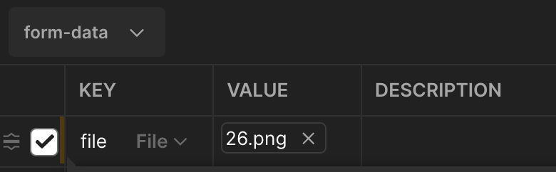

# file-storage
An example of file-storage API for images written with stdlib only usage. Its basic functionality consists of image uploading/downloading from OS file system.

## Configuration
Currently, configuration is stored in code: `file-storage/config/config.go`.

| First Header  | Description | Default value |
| ------------- | ------------- | ------------- |
| Config.Server.Host  | Host that must be used for server start. | `localhost` | 
| Config.Server.Port  | Port to be used for server.  | `8080` |
| Config.Storage.FileDir  | Path to directory where files will be stored. It must be already existing directory.  | `files/` |
| Config.API.MaxFileSize  | Maximal size of an image that can be uploaded.  | `10485760` ~10MB |
| Config.API.ValidContentTypes  | List of content-types that allowed to upload.  | `["image/jpeg", "image/jpg", "image/gif", "image/png"]` |


## API
### Upload
URL: `host:port/files`   
Method: `POST`  
Body: `form-data` that contains `file` key with corresponding file content

Hint for Postman usage (body example):   


### Download
URL: `host:port/files?name=26.png`   
Method: `GET`

### List
URL: `host:port/files/list`   
Method: `GET`  
Output example:
```
file name: [26.png] | file size: [1464421 bytes]
file name: [28.png] | file size: [596578 bytes]
file name: [36.png] | file size: [502848 bytes]
```


## Potential features:
- [ ] Store meta-information in DB
- [ ] Store images in S3-like storage
- [ ] Move configuration to ENV variables
- [ ] Define permissions model
- [ ] Cover by unit-tests